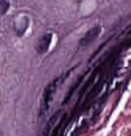

# emoxel
Specalized biomedical image preprocessing and convoluation using human centered focus, specifially emoji representations.

By harnessing the inheret humanity of emotions (using a distance metric including intensity, edge density, and entropy) we successfully* detect benign or malignant regions of interest.
--- from ---

--- to --- 

💻🟫◼️☁🟦🌑🌑

🟫🌘💻🌑🅿🅰⬛

☁◼️🅱🌑🅿⬛⬛

◼️🌑🌑🅿⬛⬛🧔🏿‍♀️

◼️🌑⚫⬛⬛⬛👩🏿

◼️🌑⬛⬛⬛🕋⌚

◼️🌑⬛⬛⚫🙎🏿‍♀👩🏿‍❤️‍💋‍👨🏿

This was then used to train a model which was able to distinguish benign snd malignant regions, thus proving that doctors should ask patients about their emotions.

## running the emoxel implementation
first, add emoji as 32x32x3 pngs with filenames as emoji_png/index_(emoji unicode character).png

then you can convert images to an emoxelfied form with commands as shown in emoxelify_breakhis.py. this requires python and node, and is surprisingly fiddly.

this can be added to a dataset and trained, see train_model.py.

# emoxel layer method

to represent instead a doctor consulting their own feelings, we describe a model architecture which concerts an image to an emoji, then uses some emoji to numerical conversion (like sentiment analysis witj another dataset, see emoji_sense subdirectory) which can be used to classify the image. see train_emoji_layer.py for a reference implementation.

## further work
the two ways to extend this layer method is to improve the contrast preprocessing before the emoji layer, but also tilo use an emoji set with more emotinal features, so the model can account for more of the human emotinal experience at once, rather than sentiment as positive and negative as is the current reference implementation. if there's one thing we can confirm from both the emoxel and emoji layer, it's that emotion and thus emoji are essential to medicine 

